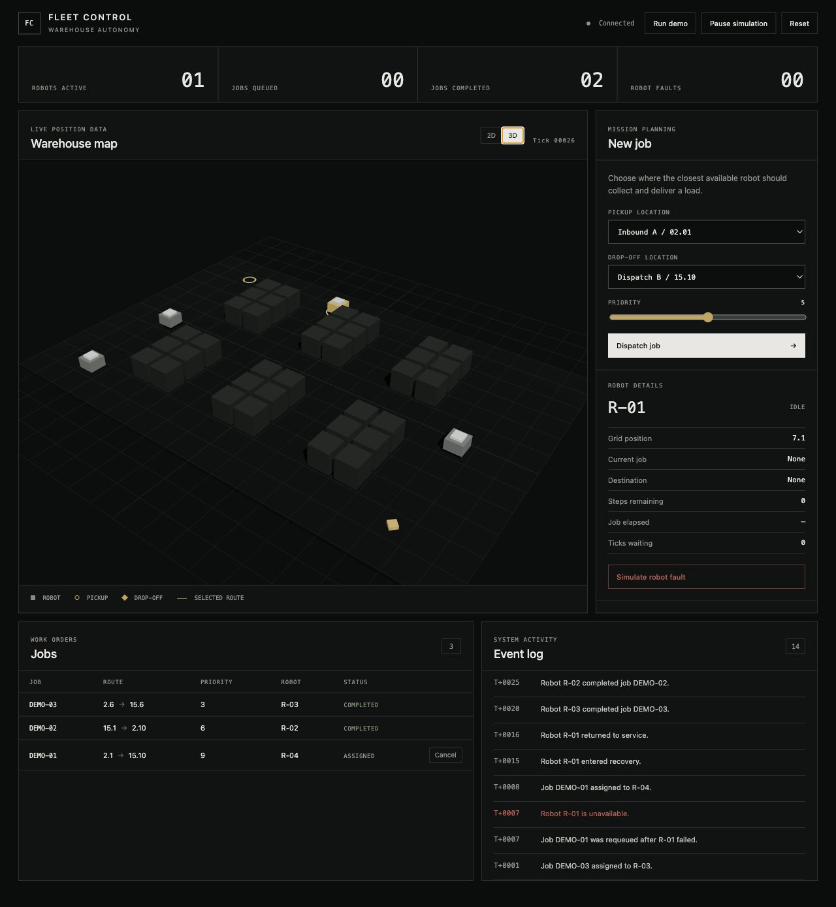

# Fleet Control



Fleet Control is a deterministic multi-robot warehouse simulator. It demonstrates
the core engineering problems behind autonomous fulfillment: scheduling, A* path
planning, collision avoidance, state coordination, failure recovery, and live
operational telemetry. Robots also manage finite batteries and interrupt work
to recharge safely.

Robots can also run dedicated recurring missions. Traffic coordination combines
priority-based right-of-way, waiting-time fairness, cell and edge reservations,
and dynamic A* replanning when congestion persists.

The system is intentionally small enough to explain end to end. It is a
simulation—not a production robot controller or a ROS deployment.

## Demonstration scenario

1. Create a fulfillment job.
2. The scheduler selects the nearest eligible robot.
3. A* calculates a shortest traversable route to pickup.
4. The robot moves one cell per simulation tick.
5. Cell reservations prevent collisions and head-on swaps.
6. Energy planning preserves enough charge to reach a charging station.
7. A low-energy robot charges to 100% and resumes its interrupted job.
8. Fail the active robot from Mission Control.
9. Its route is discarded and its job returns to the queue.
10. Another eligible robot plans a new route and completes delivery.

Pause the clock and use **STEP +1** to inspect each scheduling and state
transition deterministically. The dashboard restores authoritative run state on
reload and reconnects automatically if the live link is interrupted.

Use **Run demo** for an automatic portfolio scenario with three prioritized
jobs, robot assignment, a simulated fault, job reassignment, robot recovery,
and completed deliveries. Switch between the operational 2D map and interactive
3D digital-twin view at any time.

Each grid move consumes one battery unit. Before continuing a route leg, the
coordinator calculates the remaining route plus the shortest obstacle-aware
path from its destination to a charger. The dashboard exposes charger locations,
battery percentage, move budget, charging count, and fleet-average charge.

The built-in benchmark runs the same deterministic six-job workload with
nearest-robot and traffic-and-energy-aware assignment. It reports throughput,
average delivery time, waiting events, and charging stops, so performance claims
come from the simulator rather than hard-coded values.

## Architecture

```text
React / TypeScript dashboard
        │ REST commands + WebSocket telemetry
        ▼
FastAPI adapter
        │
FleetCoordinator
  ├── priority + nearest-robot scheduler
  ├── A* route planner
  ├── collision reservation policy
  └── failure / requeue state machine
        │
Domain models: WarehouseMap, Robot, Job, Position
```

The domain and application layers do not import FastAPI or React. That boundary
keeps the important robotics behavior deterministic and testable.

## Technology

- Python 3.13, FastAPI, Pydantic
- A* search with a Manhattan-distance heuristic
- React 19, TypeScript, Vite
- REST commands and WebSocket telemetry
- SQLite persistence
- pytest, Vitest, React Testing Library, GitHub Actions
- Three.js and React Three Fiber
- Docker and Docker Compose

## Run locally

Create the backend environment:

```bash
cd backend
python3 -m venv .venv
source .venv/bin/activate
pip install -r requirements-dev.txt
cd ..
```

Terminal one:

```bash
python3 -m uvicorn fleet_control.api.app:app \
  --app-dir backend --reload --port 8100
```

Terminal two:

```bash
cd frontend
npm install
npm run dev
```

Open `http://127.0.0.1:5173`.

Or run the production containers:

```bash
docker compose up --build
```

Open `http://127.0.0.1:8080`.

## Verification

```bash
python3 -m pytest backend/tests -q
cd frontend && npm test && npm run build
```

The backend suite verifies domain invariants, shortest-path behavior, obstacle
routing, unreachable routes, job assignment, cancellation, collision safety,
delivery, charging and job resumption, persistence, the automated demo, failure
requeue, robot recovery, and
API validation. Frontend tests cover authoritative rendering, dispatch,
cancellation, and demo controls.

## Engineering tradeoffs

- The simulation advances on a fixed clock for reproducible behavior.
- Robots use conservative cell reservations: a unit never enters a cell occupied
  at the start of the current tick. This reduces throughput slightly but makes
  collisions and head-on swaps impossible.
- A* plans around static shelves. Dynamic congestion is handled at execution time
  through yielding rather than full multi-agent replanning.
- State transitions are explicit and validated, preventing impossible lifecycle
  jumps such as `idle → unloading`.

See [ARCHITECTURE.md](ARCHITECTURE.md) for the component-level model.
