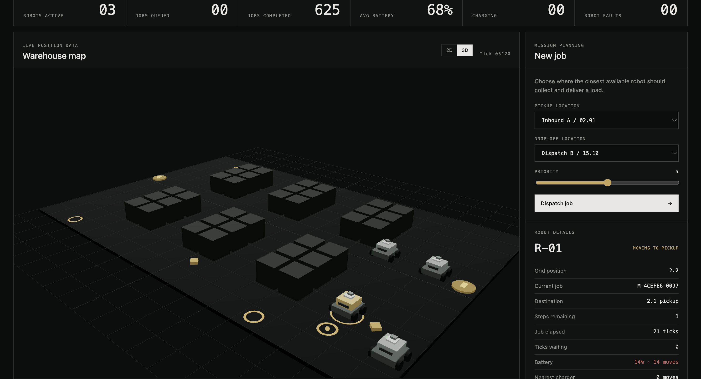
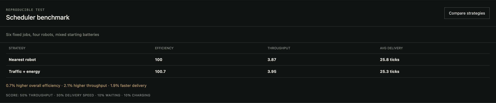
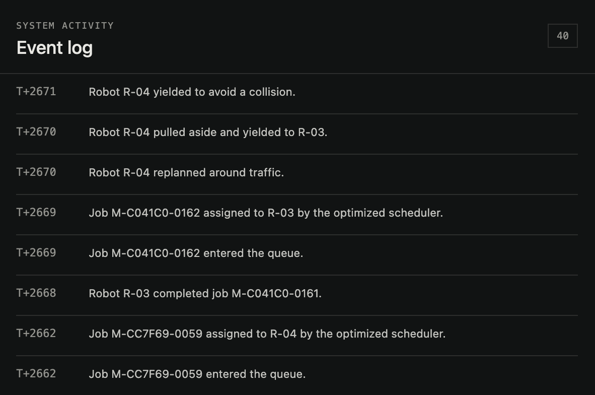

# Fleet Control

A multi-robot warehouse simulation built with Python, FastAPI, React, and
TypeScript.



## Key engineering work

- **Path and traffic planning:** A* finds obstacle-aware routes. Cell and edge
  reservations prevent collisions; priority, yielding, and replanning resolve
  shared-path conflicts.
- **Battery management:** Every move consumes energy. A robot preserves enough
  charge to reach a station, pauses its job, charges, and resumes the same route.
- **Fleet reliability:** Failed robots release their jobs for reassignment.
  SQLite restores fleet state after a restart, while WebSockets stream live
  updates to the dashboard.
- **Delivery:** The application is tested in GitHub Actions, packaged with
  Docker, and deployed on AWS EC2.

### Scheduler optimization

The benchmark gives the same six jobs, robots, and starting batteries to two
schedulers. The baseline chooses the nearest robot. The optimized scheduler also
estimates charging delay and short-term route congestion before assigning work.
In this fixed scenario it produced 2.1% higher throughput and 1.9% faster average
delivery. These results are scenario-specific rather than general performance
claims.



The event log makes traffic decisions observable, including yielding,
right-of-way, job assignment, and replanning.



## Author and contact

Mark — [GitHub profile](https://github.com/morklv)

## Bug tracker

Report problems through
[GitHub Issues](https://github.com/morklv/fleet-control/issues).

## Known issues

- This is an educational grid simulation, not a production robot controller or
  ROS system.
- Traffic is coordinated through discrete simulation ticks rather than
  continuous physical motion.
- The 3D frontend produces a large JavaScript bundle.
- The live AWS demo uses HTTP rather than HTTPS.

## Build

Backend environment:

```bash
python3 -m venv .venv
source .venv/bin/activate
pip install -r backend/requirements-dev.txt
```

Frontend dependencies and production build:

```bash
cd frontend
npm install
npm run build
```

The complete containerized application can also be built with:

```bash
docker compose build
```

## Run

Start the backend:

```bash
source .venv/bin/activate
python -m uvicorn fleet_control.api.app:app --app-dir backend --reload --port 8100
```

Start the frontend in a second terminal:

```bash
cd frontend
npm run dev
```

Open `http://127.0.0.1:5173`.

Alternatively:

```bash
docker compose up
```

Then open `http://127.0.0.1:8080`.

Live deployment: [Fleet Control on AWS](http://52.25.23.81:8080)

## Test

Backend:

```bash
source .venv/bin/activate
python -m pytest backend/tests -q
```

Frontend:

```bash
cd frontend
npm test
npm run build
```
